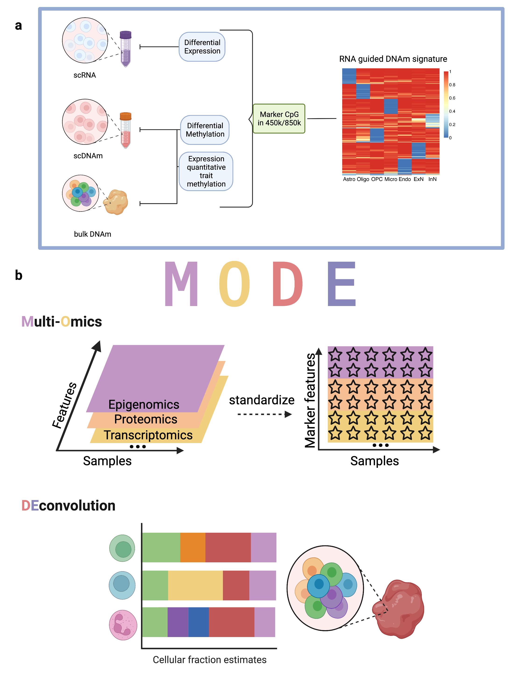

# MODE
MODE (Multi-Omics Deconvolution) is a joint deconvolution method which can provide more accurate estimates of the unified underlying cellular fractions than deconvolving each omics data type separately.

## Installation
```
devtools::install_github("randel/MODE")
```

## Workflow



Tutorial
-----------------
https://randel.github.io/MODE/

